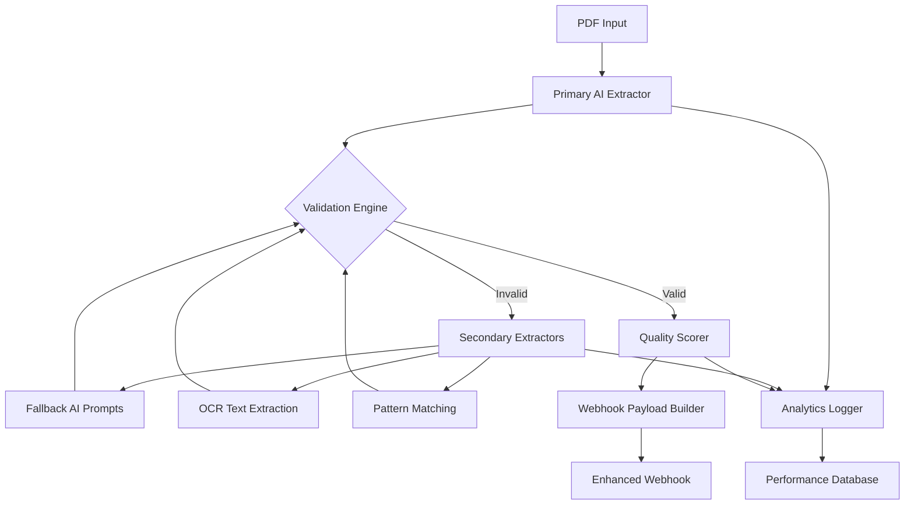

# Design Document

## Overview

This design enhances the existing bank email processor to achieve 95%+ transaction extraction accuracy through a multi-layered approach combining improved AI prompting, fallback extraction strategies, comprehensive validation, and detailed monitoring. The system will maintain backward compatibility while adding robust error handling and quality assurance mechanisms.

## Architecture

### High-Level Architecture



### Component Interaction Flow

1. **PDF Processing Pipeline**: Enhanced extraction with multiple strategies
2. **Validation Layer**: Real-time data quality checks
3. **Fallback System**: Alternative extraction methods
4. **Analytics Engine**: Performance tracking and pattern identification
5. **Enhanced Webhook**: Quality-aware data transmission

## Components and Interfaces

### 1. Enhanced AI Extractor (`EnhancedTransactionExtractor`)

**Purpose**: Improved primary extraction with specialized prompts and confidence scoring

**Key Methods**:
```typescript
interface EnhancedTransactionExtractor {
  extractWithConfidence(pdfBuffer: Buffer): Promise<ExtractionResult>
  extractWithSpecializedPrompt(pdfBuffer: Buffer, bankType: string): Promise<ExtractionResult>
  detectBankFormat(pdfBuffer: Buffer): Promise<BankFormat>
}

interface ExtractionResult {
  transactions: Transaction[]
  confidence: number
  method: string
  processingTime: number
  errors: ExtractionError[]
}
```

**Enhancements**:
- Multiple specialized prompts for different bank formats
- Confidence scoring for each extracted transaction
- Bank format detection for prompt selection
- Detailed error reporting

### 2. Fallback Extraction Engine (`FallbackExtractor`)

**Purpose**: Alternative extraction methods when primary AI fails

**Key Methods**:
```typescript
interface FallbackExtractor {
  extractWithOCR(pdfBuffer: Buffer): Promise<ExtractionResult>
  extractWithPatternMatching(pdfBuffer: Buffer): Promise<ExtractionResult>
  extractWithAlternativePrompts(pdfBuffer: Buffer): Promise<ExtractionResult>
}
```

**Strategies**:
- **OCR-based extraction**: Convert PDF to text, then extract using text processing
- **Pattern matching**: Use regex patterns for common transaction formats
- **Alternative AI prompts**: Different prompt strategies for edge cases
- **Hybrid approach**: Combine multiple methods for maximum coverage

### 3. Validation Engine (`TransactionValidator`)

**Purpose**: Comprehensive data quality validation and normalization

**Key Methods**:
```typescript
interface TransactionValidator {
  validateTransaction(transaction: Transaction): ValidationResult
  normalizeTransaction(transaction: Transaction): Transaction
  detectQualityIssues(transaction: Transaction): QualityIssue[]
}

interface ValidationResult {
  isValid: boolean
  issues: QualityIssue[]
  confidence: number
  suggestions: string[]
}

interface QualityIssue {
  field: string
  issue: string
  severity: 'warning' | 'error'
  suggestion?: string
}
```

**Validation Rules**:
- **Required fields**: Ensure all mandatory fields are present
- **Data format**: Validate dates, amounts, reference numbers
- **Business logic**: Check for reasonable amounts, valid dates
- **Cross-field validation**: Ensure data consistency

### 4. Analytics Engine (`ExtractionAnalytics`)

**Purpose**: Performance monitoring and pattern identification

**Key Methods**:
```typescript
interface ExtractionAnalytics {
  logExtractionAttempt(result: ExtractionResult, metadata: ExtractionMetadata): void
  identifyFailurePatterns(): FailurePattern[]
  generatePerformanceReport(): PerformanceReport
  trackMethodEffectiveness(): MethodStats[]
}

interface ExtractionMetadata {
  pdfHash: string
  fileSize: number
  pageCount: number
  bankFormat?: string
  timestamp: Date
}
```

### 5. Enhanced Webhook Service (`EnhancedWebhookService`)

**Purpose**: Quality-aware webhook payload with detailed metadata

**Enhanced Payload Structure**:
```typescript
interface EnhancedWebhookPayload {
  transactions: EnhancedTransaction[]
  extractionMetadata: {
    totalTransactions: number
    successfulExtractions: number
    averageConfidence: number
    extractionMethod: string
    processingTime: number
    qualityScore: number
  }
  qualityReport: {
    issues: QualityIssue[]
    warnings: string[]
    recommendations: string[]
  }
}

interface EnhancedTransaction extends Transaction {
  confidence: number
  extractionMethod: string
  qualityFlags: string[]
  validationStatus: 'valid' | 'warning' | 'error'
}
```

## Data Models

### Enhanced Transaction Model

```typescript
interface EnhancedTransaction {
  // Original fields
  nazivSedistePrimaoca: string
  iznosOdobrenja: string
  pozivNaBrojOdobrenja: string
  referentnaOznaka: string
  datumKnjizenja: string
  
  // Enhancement fields
  confidence: number
  extractionMethod: string
  qualityFlags: string[]
  validationStatus: 'valid' | 'warning' | 'error'
  normalizedAmount?: number
  normalizedDate?: Date
  qualityIssues: QualityIssue[]
}
```

### Analytics Models

```typescript
interface ExtractionAttempt {
  id: string
  timestamp: Date
  pdfHash: string
  method: string
  success: boolean
  confidence: number
  processingTime: number
  transactionCount: number
  errors: ExtractionError[]
}

interface FailurePattern {
  pattern: string
  frequency: number
  commonErrors: string[]
  suggestedFix: string
}
```

## Error Handling

### Error Classification

1. **Extraction Errors**: AI model failures, timeout issues
2. **Validation Errors**: Data quality issues, format problems
3. **System Errors**: File processing, memory issues
4. **Business Logic Errors**: Invalid transaction data

### Error Recovery Strategy

```typescript
class ExtractionErrorHandler {
  async handleExtractionFailure(error: ExtractionError, context: ExtractionContext): Promise<ExtractionResult> {
    switch (error.type) {
      case 'AI_TIMEOUT':
        return await this.retryWithReducedComplexity(context)
      case 'INVALID_PDF':
        return await this.attemptOCRExtraction(context)
      case 'LOW_CONFIDENCE':
        return await this.tryAlternativePrompts(context)
      default:
        return this.createFailureResult(error)
    }
  }
}
```

## Testing Strategy

### Unit Testing
- Individual component testing for each extractor
- Validation rule testing with edge cases
- Analytics calculation verification

### Integration Testing
- End-to-end extraction pipeline testing
- Webhook payload validation
- Database integration testing

### Performance Testing
- Large PDF processing benchmarks
- Concurrent extraction testing
- Memory usage optimization

### Quality Assurance Testing
- Test with known problematic PDFs (from the 10-20% failure cases)
- Validate against the Excel data you provided
- Cross-validation with manual extraction results

### Test Data Strategy
- Use the problematic transactions from your Excel file as test cases
- Create synthetic PDFs with known extraction challenges
- Maintain a test suite of various bank statement formats

## Implementation Phases

### Phase 1: Enhanced Primary Extractor
- Improve existing AI prompts with specialized bank format detection
- Add confidence scoring to current extraction
- Implement basic validation rules

### Phase 2: Fallback Systems
- Implement OCR-based extraction
- Add pattern matching for common formats
- Create alternative prompt strategies

### Phase 3: Analytics and Monitoring
- Build extraction analytics system
- Implement performance tracking
- Create failure pattern identification

### Phase 4: Enhanced Webhook Integration
- Extend webhook payload with quality metadata
- Add quality flags and validation status
- Implement comprehensive error reporting

## Performance Considerations

### Optimization Strategies
- **Caching**: Cache bank format detection results
- **Parallel Processing**: Run multiple extraction methods concurrently
- **Resource Management**: Implement extraction timeouts and memory limits
- **Incremental Improvement**: Use analytics to continuously refine prompts

### Scalability
- Stateless extraction components for horizontal scaling
- Database optimization for analytics storage
- Efficient PDF processing with streaming where possible

## Security Considerations

### Data Protection
- Secure handling of financial transaction data
- Audit logging for all extraction attempts
- Data retention policies for analytics

### Error Information
- Sanitize error messages to avoid data leakage
- Secure storage of failed extraction attempts
- Access controls for analytics data

## Monitoring and Alerting

### Key Metrics
- Extraction success rate (target: 95%+)
- Average confidence scores
- Processing time per PDF
- Quality issue frequency

### Alerting Thresholds
- Success rate drops below 90%
- Average processing time exceeds 30 seconds
- High frequency of specific error types
- Quality score degradation trends